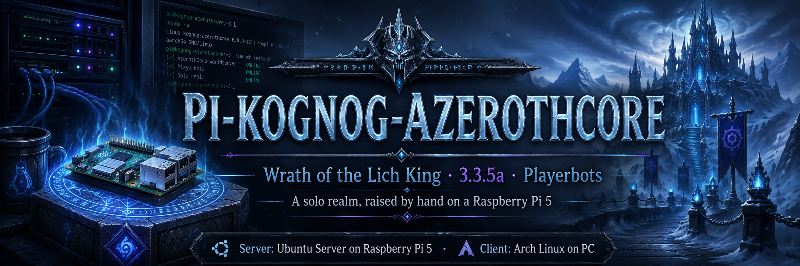

-7FD4F5.svg)

---

##  What this is

A **step-by-step, verified guide** to running your own **World of Warcraft: Wrath of the Lich King (3.3.5a)** server with **AzerothCore + Playerbots**, on a **Raspberry Pi 5 (ARM64)**, for solo play with a bot party — on an all-Linux stack, client included.

It is written for someone who has never done this before. Every chapter assumes nothing, explains what each piece *is* before telling you to install it, and ends with a **checkpoint** so you know whether it worked before moving on.

##  Why this guide exists

There are many AzerothCore tutorials. Almost all of them are **x86_64**, and most are transcribed from someone else's video.

This one is different in two ways:

1. **It targets ARM64.** Running AzerothCore, and especially **Playerbots**, on a Raspberry Pi is barely documented. The problems you hit there often have no answer anywhere. This guide is where those answers get written down.
2. **It is written live, then destroyed and rebuilt.** Nothing here is copied from a video. Each chapter is written as the step is actually performed on real hardware. Then the entire server is **wiped and built again from zero, following only this guide**, to find the steps that quietly depended on state we forgot we created. That loop repeats until a single clean run works start to finish, with no deviations.

##  The guide

### **→ [Read the guide](https://jetomev.github.io/pi-kognog-azerothcore/)** ←

All eleven chapters (00–10), the optional extras, troubleshooting, and Q&A live on the guide site — with a navigation menu, per-page step index, and search. From bare metal to a realm that boots itself, backs itself up, and hosts your bot party.

*(The same content is browsable in-repo under [`docs/`](docs/README.md), and every script and systemd unit ships in [`scripts/`](scripts) and [`systemd/`](systemd).)*

##  Prerequisite zero: the client

AzerothCore is a **3.3.5a server, client build 12340** (2010). **Modern retail WoW will not work. WoW Classic will not work either** — different builds, and Blizzard's clients authenticate against Battle.net. You need your own 3.3.5a (12340) client; sourcing it is your responsibility and outside the scope of this guide. We do not link or distribute it.

##  Contributing & feedback

Hit a problem the guide did not cover? **[Open an issue](https://github.com/jetomev/pi-kognog-azerothcore/issues)** — that's the front door for every question, correction, and war story. Solved it yourself? Open an issue anyway and tell us how, and it goes into the troubleshooting pages with credit. See [CONTRIBUTING.md](CONTRIBUTING.md).

##  Authors

A human and an AI, working as co-authors:

- **Balih Kognog** — direction, hardware, testing, the decision to wipe it all and do it again.
- **Auren Vael** (Claude, Anthropic) — architecture, drafting, and keeping the archive honest. 🪶

##  License

GPL-3.0-or-later. See [LICENSE](LICENSE).

*World of Warcraft and Wrath of the Lich King are trademarks of Blizzard Entertainment. This project is not affiliated with, endorsed by, or connected to Blizzard in any way. [AzerothCore](https://www.azerothcore.org/) is an independent open-source project.*
