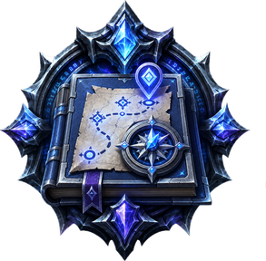
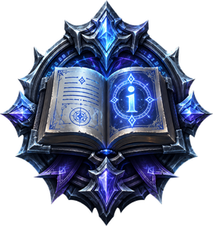
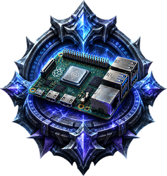
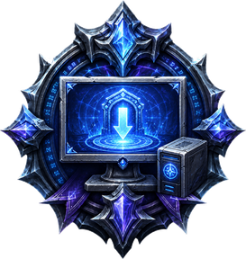

# The guide

A **step-by-step, verified guide** to running your own **World of Warcraft: Wrath of the Lich King (3.3.5a)** server with **AzerothCore + Playerbots**, on a **Raspberry Pi 5 (ARM64)**, for solo play with a bot party — on an all-Linux stack, client included.

Chapters are written **in the order they are performed**, on the real hardware, and only after the step actually worked. Use the **menu on the left** to jump to any chapter; the **menu on the right** navigates the steps inside it.

##  Chapters

| # | Chapter | Status |
|---|---------|--------|
| 00 | [Provisioning the Pi](00-provisioning.md) | ✅ done |
| 01 | [The client and extracting game data](01-client-and-data.md) | ✅ done |
| 02 | [ARM64 build toolchain and dependencies](02-build-toolchain.md) | ✅ done |
| 03 | [MySQL and the four databases](03-database.md) | ✅ done |
| 04 | [Cloning AzerothCore + the Playerbots fork](04-cloning.md) | ✅ done |
| 05 | [Building](05-building.md) | ✅ done |
| 06 | [Configuration](06-configuration.md) | ✅ done |
| 07 | [First boot](07-first-boot.md) | ✅ done |
| 08 | [The client side](08-client-side.md) | ✅ done |
| 09 | [Your bot party](09-bot-party.md) | ✅ done |
| 10 | [Keeping it alive](10-keeping-it-alive.md) | ✅ done |

**Optional:** [The bot handbook](optional-bot-handbook.md) · [Adding modules](optional-modules.md) · [Client add-ons](optional-client-addons.md) · [Off-box backups](optional-offbox-backups.md) — done *after* the base realm works.

**Reference:** [Troubleshooting](TROUBLESHOOTING.md) · [Q&A](QA.md) · [Sources](SOURCES.md) · [Thanks](THANKS.md)

##  How to read a chapter

Every chapter follows the same shape, so you always know where you are:

1. **What this is** — plain language. What the piece does and why it exists, before you are told to install anything.
2. **Why it matters** — what breaks later if you skip or fumble it.
3. **Before you start** — what must already be true (previous chapters, files, credentials).
4. **Steps** — numbered, one action each, with the command and what each flag means.
5. **✅ Checkpoint** — exactly what you should see if it worked. Do not continue past a failed checkpoint.
6. **⚠ If it went wrong** — the failures we actually hit here, and the fix. Links into [Troubleshooting](TROUBLESHOOTING.md) for the long ones.

##  Conventions

- Commands are shown bare, with no prompt prefix, so every block copy-pastes directly.
- Each chapter's prose says whether a block runs **on the Pi** or **on your desktop**.
- Commands needing root are shown with `sudo` explicitly. Nothing is silently elevated.
- Paths are absolute wherever ambiguity is possible.
- Anything that takes more than a few minutes says so, with a rough duration, so you know the difference between "slow" and "hung".

### Connecting to your server

Every chapter from 02 onward runs **on the Pi**, so each one opens with the same
reminder: get an SSH session first. From your desktop:

```
ssh -i ~/.ssh/id_ed25519_tpgaming tphome@192.168.1.220
```

(Substitute your key path and the static IP you set in Chapter 00.) Enter your key
passphrase; you should land at `tphome@tpgaming01:~$`. A graphical SSH client such as
**Termius** works too — point it at the same host, user, and key. If the connection is
refused, confirm the Pi is powered on and reachable (`ping 192.168.1.220`); if it asks
for a password instead of the key, see the `Permission denied (publickey)` entry in
[Troubleshooting](TROUBLESHOOTING.md).

##  The hardware

| | |
|---|---|
| **Host** | Raspberry Pi 5, 16 GB RAM (`tpgaming01`, `192.168.1.220`) |
| **OS** | Ubuntu Server (ARM64), running from the microSD |
| **Storage** | 64 GB microSD (OS) + 128 GB NVMe on a HAT (game data, build, databases) |
| **Arch** | ARM64 / aarch64 |
| **Load target** | one human player + a 3-bot party (tank, healer, 2 dps) |

A note on scale, honestly: this sizing is for **solo play**. A 4-man party on a Pi 5 is comfortable. A populated world with dozens of bots is a different machine's problem; Playerbots is CPU-hungry and the Pi has four cores.

##  Prerequisite zero: the client

AzerothCore is a **3.3.5a server, client build 12340** (2010). This matters more than anything else on this page:

- **Modern retail WoW will not work.** It is many expansions past 3.3.5a.
- **WoW Classic will not work either.** The Classic lines are different builds, and Blizzard's current clients authenticate against Battle.net; they cannot be pointed at a private realm.
- **Battle.net does not distribute 3.3.5a.**

You need your own 3.3.5a (12340) client. Every map, model, and DBC file in this guide is extracted from it. Sourcing it is your responsibility and outside the scope of this guide; we do not link or distribute it.

##  The validation loop

This guide is not finished when the server runs. It is finished when the guide **builds the server from nothing, unaided**.

1. Write the chapters live while doing it the first time.
2. Wipe the Pi back to a clean baseline image and rebuild, **following only the guide**.
3. Every deviation, every "oh, I also had to…", gets written down before continuing.
4. Repeat until one run completes start to finish with zero deviations.
5. Then publish, and let other people's hardware find the rest.

##  Feedback

Hit a problem this guide did not cover? **[Open an issue](https://github.com/jetomev/pi-kognog-azerothcore/issues)** — that's the front door for every question, correction, and war story. Solved something yourself? Open an issue anyway and tell us how; it goes into [Troubleshooting](TROUBLESHOOTING.md) with credit. That last 5% (the problems we will never hit on our own hardware) only gets documented if people bring them back.

##  Authors

A human and an AI, working as co-authors:

- **Balih Kognog** — direction, hardware, testing, the decision to wipe it all and do it again.
- **Auren Vael** (Claude, Anthropic) — architecture, drafting, and keeping the archive honest. 🪶

##  License

GPL-3.0-or-later. See [LICENSE](https://github.com/jetomev/pi-kognog-azerothcore/blob/main/LICENSE).

*World of Warcraft and Wrath of the Lich King are trademarks of Blizzard Entertainment. This project is not affiliated with, endorsed by, or connected to Blizzard in any way. [AzerothCore](https://www.azerothcore.org/) is an independent open-source project.*
