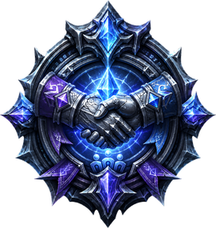

#  Optional — The bot handbook

Chapter 09 gets your party summoned and following. This page is the **field manual for
actually living with them** — vendoring their overflowing bags, handing them gear, setting
roles, pulling with marks, changing specs. Everything here was learned commanding a live
party on the Pi; the authoritative and complete reference is the
[mod-playerbots Playerbot Commands wiki](https://github.com/mod-playerbots/mod-playerbots/wiki/Playerbot-Commands),
which this page distills rather than replaces.

> **How to talk to a bot.** Every command below is plain chat: **`/p <command>`** orders
> the whole party, **`/w BotName <command>`** orders one bot. Where a command takes an
> **[item]**, you **shift-click the item** to link it into the message — from your own
> bags, the trade window, or a bot's whispered list. `/w BotName help` makes any bot
> whisper you its own command list. (Only the `.playerbots …` commands are GM console
> commands; everything else is normal chat.)

You can also target by **role or class** instead of name in party/raid chat:
`@tank`, `@heal`, `@dps`, `@ranged`, `@melee`, `@warrior`, `@priest` … e.g.
`/p @heal stay` parks just the healer.

## Movement and positioning

| Command | What it does |
|---|---|
| `follow` | Regroup on you and follow — the everyday command. |
| `stay` | Hold position. |
| `flee` | Run to you, ignoring everything — the "abort!" button. |
| `summon` | Teleport a lost bot to you (out of combat). |
| `grind` | Attack anything visible — turn a bot loose on a camp. |
| `disperse set <yards>` | Keep bots spread N yards apart (AoE avoidance). |
| `disperse disable` | Back to default spacing. |

## Combat

| Command | What it does |
|---|---|
| `attack` / `attack my target` | Focus-fire the bot's target / your target. |
| `pull` | The tank opens on the target with a ranged pull. |
| `rti skull` (cross, circle…) | Set the priority kill icon; bots burn it first. |
| `attack rti target` | Attack whatever carries the icon. |
| `rti cc moon` | Mark a target for crowd control instead. |
| `focus heal +Name` / `-Name` / `?` | Manage the healer's priority-heal list. |
| `wait for attack time 3` | Bots hold N seconds before joining a fight (let the tank build threat). |

**Strategies** are the deeper dial — persistent behaviours you switch on and off, with
`co` (combat) and `nc` (non-combat):

```
/p co ?              show active combat strategies
/w Tankname co +tank aoe    the warrior holds groups, not just one mob
/w Magename co +aoe         the mage opens up the big spells
/p co +avoid aoe     everyone steps out of the fire
/p nc +loot          everyone loots after combat
/p co !              reset combat strategies to default
```

Role strategies worth knowing: `tank`, `heal`, `dps`, `assist`, `aoe`, `cc`,
`save mana`, `behind` (melee gets behind the target). Bots also auto-load raid-specific
strategies when they zone into instances (Karazhan, Naxx, Ulduar, ICC…).

## Loot

| Command | What it does |
|---|---|
| `nc +loot` | Master switch: bots loot after combat. |
| `ll normal` | Loot everything except BoP (the sane default). |
| `ll all` / `ll gray` / `ll quest` | Loot everything / junk only / quest items only. |
| `ll skill` | Also loot herbs / ore / skins for professions. |
| `roll [item]` | The linked bot rolls need/greed on an upgrade; bare `roll` = all bots. |

## Bags, vendors, and trading

The one that catches everyone: **bots fill their bags and then can't receive anything** —
a trade silently fails if the bot has no free slot. Empty them first.

| Command | What it does |
|---|---|
| `s *` | Sell all **grey junk** (bot runs to the nearest vendor). |
| `s vendor` | Sell **everything sellable** — the deep clean. |
| `s [item]` | Sell one specific item. |
| `destroy [item]` | Delete an item, no vendor needed. |
| `open items` | Open lockboxes/containers sitting in bags. |
| `maintenance` | Housekeeping: repair, learn new spells, stock consumables. |
| `b [item]` | Buy an item from the vendor you're at. |
| `bank [item]` / `bank -[item]` | Deposit / withdraw at a banker. |
| `2g 50s` | Supposed to make the bot hand you that much gold — **broken on this fork's current build**: the bot opens the trade, adds the gold, then rejects its own trade. Field-tested repeatedly (any amount). Use a GM instead: `.modify money <copper>` on yourself (10000 copper = 1g). |

**Trading with a bot** is just the normal trade window: target the bot, right-click its
portrait → Trade (or drag an item onto it). The bot presents and accepts. Field-tested
sequence for gearing a bot up:

```
/p s *                      near a vendor: everyone dumps the junk
(trade the bot your item)   it lands in the bot's bags — not equipped yet
/w Botname e [item]         shift-click the item you just gave: equip it
```

## Gear

| Command | What it does |
|---|---|
| `e [item]` | Equip the linked item. |
| `ue [item]` | Unequip it. |
| `autogear` | Bot re-equips the best it owns — quality-capped by `AiPlayerbot.AutoGearQualityLimit` in `playerbots.conf` (this guide sets `3` = up to rare). |
| `outfit ?` | The outfit system: save gear sets (`outfit tank +[item]…`), then `outfit tank equip` / `replace` / `update`. |

Remember the Chapter 09 distinction: **addclass/random bots auto-gear on their own;
altbots never do** — altbots wear exactly what you give them, which is the point.

## Talents and spells

| Command | What it does |
|---|---|
| `talents` | Show current spec and point spread. |
| `talents spec list` / `talents spec <name>` | List specs for the class / force one (respec). |
| `spells` | Bot whispers its spellbook. |
| `cast <spell>` / `cast <spell> on <player>` | Cast on demand — buffs before a pull. |
| `trainer` / `trainer learn` | At a class trainer: list / learn everything due. |
| `glyphs` / `glyph equip <id>` | Inspect / socket glyphs. |

`maintenance` learns due spells too — easiest to just run it in town each level-up lap.

## Quests

Bots **mirror you automatically**: accept when you accept, turn in when you turn in, and
they share the same mob-tag credit rules you do. On top of that:

| Command | What it does |
|---|---|
| `quests` / `quests all` | Quest-log summary / full list with links. |
| `accept *` | Hoover up every quest from the NPC you're at. |
| `drop [quest]` | Abandon one. |
| `r [item]` | Pick that linked item as the quest reward. |
| `talk` | Make bots talk to the NPC you're at (turn-ins). |

## Party utilities

| Command | What it does |
|---|---|
| `who` | Race, class, spec, level, item level, zone — the roster check. |
| `stats` | Bags, gold, XP, durability at a glance. |
| `release` / `revive` | After a wipe: release spirit / take the spirit healer. |
| `home` | Set the bot's hearthstone at the innkeeper you've selected. |
| `give leader` | Bot hands party lead back to you. |
| `reset botAI` | The "turn it off and on again" for one confused bot. |
| `.playerbots bot remove <name>` / `remove *` | Dismiss one / all (GM console command). |

## Field notes from this realm

Hard-won, on the actual Pi party:

- **Full bags block trades.** If a bot won't accept your item, it's not stubborn — it's
  full. `s *` first, then trade, then `e [item]`. (This page exists because of that
  evening.)
- **Traded gear is not worn gear.** Bots bank whatever you hand them in their bags until
  you say `e [item]` or `autogear`.
- **Recruiting from the wild** (see Chapter 09): `/friend` a random bot you meet, invite
  it later from your friends list — it arrives as itself, real level and real gear.
- **`/p follow` fixes 90% of weirdness.** Bots holding position at the last corpse, bots
  lagging a zone behind — regroup and carry on. For the other 10%, `reset botAI`.

---

*Command not here? `/w <bot> help` in-game, or the
[full wiki reference](https://github.com/mod-playerbots/mod-playerbots/wiki/Playerbot-Commands).
Found a better trick? Open an issue — field notes grow this page.*
